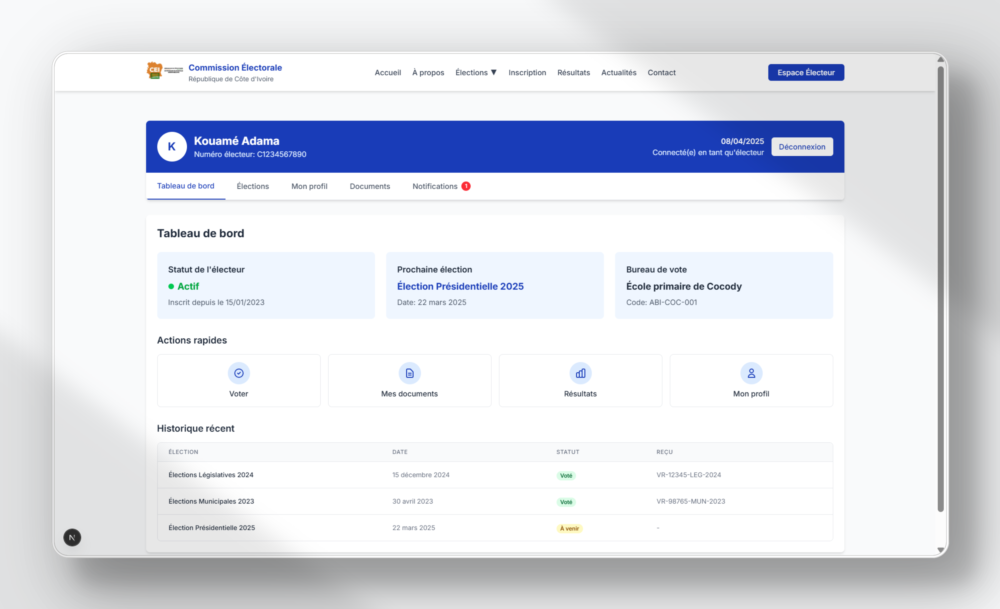

# Ivoire-Vote-CEI

Ivoire-Vote-CEI est une plateforme de vote en ligne fictive conçue comme un concept inspiré par la Commission Électorale de Côte d'Ivoire (CEI). Elle simule un processus électoral sécurisé et transparent, incluant l'inscription des électeurs, la gestion des candidats et le suivi des résultats en temps réel.

## Essayer la plateforme

Une version de démonstration de la plateforme est disponible en ligne :
[https://ivoire-vote-cei.vercel.app/](https://ivoire-vote-cei.vercel.app/)

Vous pouvez explorer toutes les fonctionnalités de l'application directement depuis votre navigateur.

## Fonctionnalités

- **Inscription des Électeurs** : Inscription sécurisée des électeurs avec une identification unique.
- **Gestion des Candidats** : Gestion des informations des candidats et des détails de leur campagne.
- **Résultats en Temps Réel** : Suivi et affichage des résultats des élections en temps réel.
- **Sécurité** : Mise en œuvre de mesures de sécurité robustes pour garantir l'intégrité du processus de vote.

## Technologies Utilisées

- **Next.js** : Un framework React pour la création d'applications rendues côté serveur.
- **JavaScript** : Le principal langage de programmation utilisé dans le projet.
- **Tailwind** : Pour le style de l'interface utilisateur.

## Démarrage

Pour obtenir une copie locale et la faire fonctionner, suivez ces étapes.

### Prérequis

Assurez-vous d'avoir les éléments suivants installés :

- [Node.js](https://nodejs.org/)
- [npm](https://www.npmjs.com/) ou [yarn](https://yarnpkg.com/) ou [pnpm](https://pnpm.io/) ou [bun](https://bun.sh/)

### Installation

1. Clonez le dépôt :
    ```bash
    git clone https://github.com/noushiFlex/ivoire-vote-cei.git
    cd ivoire-vote-cei
    ```

2. Installez les dépendances :
    ```bash
    npm install
    # ou
    yarn install
    # ou
    pnpm install
    # ou
    bun install
    ```

3. Démarrez le serveur de développement :
    ```bash
    npm run dev
    # ou
    yarn dev
    # ou
    pnpm dev
    # ou
    bun dev
    ```

4. Ouvrez [http://localhost:3000](http://localhost:3000) avec votre navigateur pour voir le résultat.

### Déploiement

Le moyen le plus simple de déployer votre application Next.js est d'utiliser la [plateforme Vercel](https://vercel.com/new?utm_medium=default-template&filter=next.js&utm_source=create-next-app&utm_campaign=create-next-app).

Consultez notre [documentation de déploiement Next.js](https://nextjs.org/docs/app/building-your-application/deploying) pour plus de détails.

## Démonstrations

Voici quelques captures d'écran de la plateforme Ivoire-Vote-CEI qui illustrent ses principales fonctionnalités :

### Interface d'accueil

*La page d'accueil présente les informations essentielles sur les élections à venir et les services de la CEI.*

### Espace d'inscription

*L'espace électeur permet aux utilisateurs de consulter leur statut, les élections à venir et leur historique de vote.*

### Espace électeur

*Notre système de vote électronique garantit un processus sécurisé et anonyme avec confirmation de réception.*

### Information sur la CEI

*Les résultats des élections sont présentés de manière claire avec des graphiques et statistiques détaillés.*

### Visualisation des résultats

*La section À propos présente l'histoire et la mission de la Commission Électorale Indépendante.*

## En Savoir Plus

Pour en savoir plus sur Next.js, consultez les ressources suivantes :

- [Documentation Next.js](https://nextjs.org/docs) - en apprendre plus sur les fonctionnalités et l'API de Next.js.
- [Apprendre Next.js](https://nextjs.org/learn) - un tutoriel interactif de Next.js.

Vous pouvez consulter [le dépôt GitHub de Next.js](https://github.com/vercel/next.js) - vos retours et contributions sont les bienvenus !

## Contribuer

Les contributions sont ce qui rend la communauté open-source si incroyable pour apprendre, inspirer et créer. Toute contribution que vous faites est **grandement appréciée**.

1. Forkez le projet.
2. Créez votre branche de fonctionnalité (`git checkout -b feature/FonctionnaliteIncroyable`).
3. Commitez vos changements (`git commit -m 'Ajouter une FonctionnaliteIncroyable'`).
4. Poussez vers la branche (`git push origin feature/FonctionnaliteIncroyable`).
5. Ouvrez une Pull Request.

## Licence

Distribué sous la licence MIT. Voir le fichier `LICENSE` pour plus d'informations.

## Contact

Votre Nom - [@votre_twitter](https://twitter.com/votre_twitter) - votre_email@example.com

Lien du projet : [https://github.com/noushiFlex/ivoire-vote-cei](https://github.com/noushiFlex/ivoire-vote-cei)